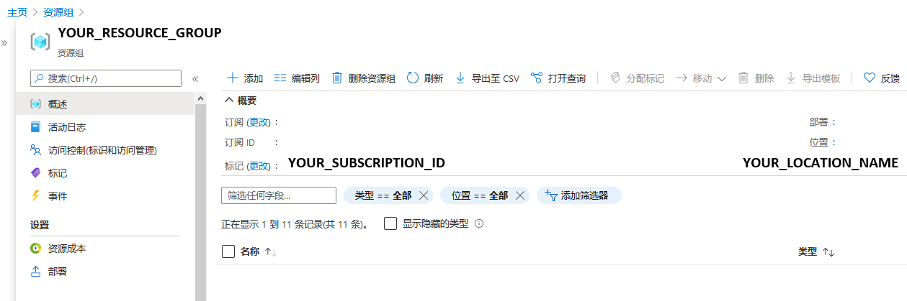

---
lab:
  title: 从表单中提取数据
  module: Module 11 - Reading Text in Images and Documents
ms.openlocfilehash: 3439c9d2d53fd0461b2fe35b095ea86d5ed3abaa
ms.sourcegitcommit: da2617566698e889ff53426e6ddb58f42ccf9504
ms.translationtype: HT
ms.contentlocale: zh-CN
ms.lasthandoff: 05/05/2022
ms.locfileid: "144776167"
---
# <a name="extract-data-from-forms"></a>从表单中提取数据 

假设公司当前要求员工手动购买订单表并将数据输入到数据库中。 他们希望利用 AI 服务改进数据输入过程。 你决定构建一个机器学习模型，该模型将读取表单并生成可用于自动更新数据库的结构化数据。

**** 表单识别器是一项认知服务，它让用户能够生成自动化数据处理软件。 此软件可使用光学字符识别 (OCR) 从表单中提取文字、键值对和表。 表单识别器有用于识别发票、收据和名片的预制模型。 该服务还提供训练自定义模式的功能。 在本练习中，我们将重点关注生成自定义模型。

## <a name="clone-the-repository-for-this-course"></a>克隆本课程的存储库

如果尚未克隆用于本课程的存储库，请克隆它：

1. 启动 Visual Studio Code。
2. 打开面板 (SHIFT+CTRL+P) 并运行“Git: 克隆”命令，以将 `https://github.com/MicrosoftLearning/AI-102-AIEngineer` 存储库克隆到本地文件夹（任意文件夹均可）。
3. 克隆存储库后，在 Visual Studio Code 中打开文件夹。
4. 等待其他文件安装完毕，以支持存储库中的 C# 代码项目。

    > **注意**：如果系统提示你添加生成和调试所需的资产，请选择“以后再说”。

## <a name="create-a-form-recognizer-resource"></a>创建表单识别器资源

要使用表单识别器服务，需在 Azure 订阅中有“表单识别器”或“认知服务”资源。 使用 Azure 门户创建资源。

1.  打开 Azure 门户 (`https://portal.azure.com`)，然后使用与你的 Azure 订阅关联的 Microsoft 帐户登录。

2. 选择“&#65291;创建资源”按钮，搜索“表单识别器”，并使用以下设置创建“表单识别器”资源：
    - **订阅**：Azure 订阅
    - 资源组：选择或创建一个资源组（如果使用受限制的订阅，你可能无权创建新的资源组 - 请使用提供的资源组）
    - **区域**：选择任何可用区域
    - **名称**：输入唯一名称
    - **定价层**：F0

    > **注意**：如果你的订阅中已有 F0 表单识别器服务，此项请选择“S0”。

3. 部署资源后，转到该资源并查看其“密钥和终结点”页面。 稍后，需要使用此页面上的终结点和其中一个密钥来由代码管理访问。  

## <a name="gather-documents-for-training"></a>收集用于训练的文档

  

你将使用此存储库中 21-custom-form/sample-forms 文件夹内的示例表单，其中包含训练和测试模型所需的所有文件。

1. 在 Visual Studio Code 中，在 21-custom-form 文件夹中展开 sample-forms 文件夹。 注意该文件夹中有以 .json 和 .jpg 结尾的文件 。

    你将使用 .jpg 文件来训练模型。  

    已生成 .json 文件，其中包含标签信息。 文件将连同表单一起上传到 blob 存储容器中。 

2. 返回到 Azure 门户 ([https://portal.azure.com](https://portal.azure.com))。

3. 查看你之前在其中创建了表单识别器资源的资源组。

4. 记下资源组“概述”页上的“订阅 ID”和“位置”。 后续步骤中需要这些值和资源组名称。



5. 在 Visual Studio Code 中，在“Explorer”窗格中右键单击“21-custom-form”文件夹，并选择“在集成终端中打开”。 

6. 在终端窗格中输入以下命令，与 Azure 订阅建立经过身份验证的连接。
    
```
az login --output none
```

7. 根据提示登录到 Azure 订阅。 然后，返回到 Visual Studio Code 并等待登录过程完成。

8. 运行以下命令以列出 Azure 位置。

```
az account list-locations -o table
```

9. 在输出中，找到与资源组位置相对应的“名称”值（例如，对于美国东部，对应的名称是 eastus） 。

    > **重要说明**：记录该“名称”值并在步骤 12 中使用它。

10. 在“Explorer”窗格中，在 21-custom-form 文件夹中选择“setup.cmd”。 你将使用此批处理脚本来运行创建需要的其他 Azure 资源所需的 Azure 命令行接口 (CLI) 命令。

11. 在 setup.cmd 脚本中，查看 rem 命令。 这些注释概括了脚本将运行的程序。 程序将会执行以下操作： 
    - 在 Azure 资源组中创建存储帐户
    - 将本地 sampleforms 文件夹中的文件上传到存储帐户中名为 sampleforms 的容器
    - 打印共享访问签名 URI

12. 使用你部署表单识别器资源时使用的订阅、资源组和位置名称对应的值，修改 subscription_id、resource_group 和 location 变量声明。 然后保存更改。

    为练习保留 expiry_date 变量的默认值。 此变量在生成共享访问签名 (SAS) URI 时使用。 实际操作时，应为 SAS 设置适当的到期日期。 可以在[此处](https://docs.microsoft.com/azure/storage/common/storage-sas-overview#how-a-shared-access-signature-works)详细了解 SAS。  

13. 在 21-custom-form 文件夹的终端中，输入以下命令以运行脚本：

```
setup
```

14. 脚本完成后，查看显示的输出并记下你的 Azure 资源的 SAS URI。

> **重要说明**：在继续操作之前，将 SAS URI 粘贴到稍后方便再次检索的位置（例如 Visual Studio Code 中的新文本文件中）。

15. 在 Azure 门户中，刷新资源组并验证它包含刚刚创建的 Azure 存储帐户。 打开存储帐户，并在左侧窗格中选择“存储资源管理器(预览)”。 然后在存储资源管理器中，展开“BLOB 容器”并选择“sampleforms”容器以验证已从本地 21-custom-form/sample-forms 文件夹上传文件  。

## <a name="train-a-model-using-the-form-recognizer-sdk"></a>使用表单识别器 SDK 训练模型

现在，你将使用 .jpg 和 .json 文件训练模型 。

1. 在 Visual Studio Code 中，在 21-custom-form/sample-forms文件夹中打开 fields.json，并查看它包含的 JSON 文档。  此文件定义了你要训练模型从表单中提取的字段。
2. 打开 Form_1.jpg.labels.json 并查看它包含的 JSON。 此文件标识了 Form_1.jpg 训练文档中的命名字段的位置和值。
3. 打开 Form_1.jpg.ocr.json 并查看它包含的 JSON。 此文件包含 Form_1.jpg 的文本布局（包括表单中所有文本区域的位置）的 JSON 表示形式。

    *在此练习中，我们为你提供了字段信息文件。对于你自己的项目，可以使用[表单识别器工作室](https://formrecognizer.appliedai.azure.com/studio)创建这些文件。使用该工具时，将自动创建字段信息文件并存储到连接的存储帐户。*

4. 在 Visual Studio Code 中，根据你的语言首选项，在 21-custom-form 文件夹中展开 C-Sharp 或 Python 文件夹。
5. 右键单击 train-model 文件夹并打开集成终端。

6. 运行适用于你的语言首选项的命令，以安装“表单识别器”包。

**C#**

```
dotnet add package Azure.AI.FormRecognizer --version 3.0.0 
```

**Python**

```
pip install azure-ai-formrecognizer==3.0.0
```

7. 查看 train-model 文件夹的内容，注意它包含配置设置的文件：
    - **C#** ：appsettings.json
    - **Python**：.env

8. 编辑配置文件，修改设置以反映以下信息：
    - 你的表单识别器资源的终结点。
    - 你的表单识别器资源的密钥。
    - 你的 blob 容器的 SAS URI。

9. 注意 train-model 文件夹包含客户端应用程序的代码文件：

    - **C#** ：Program.cs
    - **Python**：train-model.py

    打开代码文件并查看其中包含的代码，并注意以下详细信息：
    - 已导入你安装的包中的命名空间
    - Main 函数会检索配置设置，并使用密钥和终结点来创建经身份验证的客户端。 
    - 代码使用训练客户端，使用你的 blob 存储容器中的图像来训练模型，需使用你生成的 SAS URI 访问该存储容器。

10. 在 train-model 文件夹中，打开训练应用程序的代码文件：

    - **C#** ：Program.cs
    - **Python**：train-model.py

11. 返回 train-model 文件夹的集成终端，并输入以下命令以运行程序：

**C#**

```
dotnet run
```

**Python**

```
python train-model.py
```

12. 等待程序结束，然后查看模型输出。
13. 记下终端输出中的模型 ID。 你将在实验室的下一部分用到它。 

## <a name="test-your-custom-form-recognizer-model"></a>测试自定义的表单识别器模型 

1. 在 21-custom-form 文件夹中，在你的语言首选项（C-Sharp 或 Python）的子文件夹中，展开 test-model 文件夹   。

2. 右键单击 test-model 文件夹并选择“打开集成终端”。 

3. 在 test-model 文件夹的终端中，运行适用于你的语言首选项的命令，以安装“表单识别器”包。

**C#**

```
dotnet add package Azure.AI.FormRecognizer --version 3.0.0 
```

**Python**

```
pip install azure-ai-formrecognizer==3.0.0
```

如果你之前使用 pip 将该包安装到 Python 环境中，则此步骤并非必需，但确定已安装它没有坏处。

4. 在 test-model 文件夹中，编辑配置文件（appsettings.json 或 .env，具体取决于你的语言首选项）以添加以下值  ：
    - 你的表单识别器终结点。
    - 你的表单识别器密钥。
    - 训练模型时生成的模型 ID（可将终端切换回 train-model 文件夹的 cmd 控制台）。  单击“保存”以保存更改。

5. 在 test-model 文件夹中，打开客户端应用程序的代码文件（对 C# 而言是 Program.cs，对 Python 而言是 test-model.py）并查看它包含的代码，注意以下详细信息 ：
    - 已导入你安装的包中的命名空间
    - Main 函数会检索配置设置，并使用密钥和终结点来创建经身份验证的客户端。 
    - 然后使用该客户端从 test1.jpg 图像中提取表单域或值。
    

6. 返回 test-model 文件夹的集成终端，并输入以下命令以运行程序：

**C#**

```
dotnet run
```

**Python**

```
python test-model.py
```
    
7. 查看输出并观察模型的输出如何提供“CompanyPhoneNumber”和“DatedAs”等字段名称。   

## <a name="more-information"></a>详细信息

有关表单识别器服务的详细信息，请参阅[表单识别器文档](https://docs.microsoft.com/azure/cognitive-services/form-recognizer/)。
